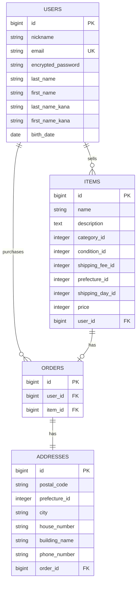

# FURIMA

フリーマーケットアプリケーションです。

## ER図

## usersテーブル

| Column             | Type   | Options                   |
|--------------------|--------|---------------------------|
| nickname           | string | null: false               |
| email              | string | null: false, unique: true |
| encrypted_password | string | null: false               |
| last_name          | string | null: false               |
| first_name         | string | null: false               |
| last_name_kana     | string | null: false               |
| first_name_kana    | string | null: false               |
| birth_date         | date   | null: false               |

### Association

- has_many :items
- has_many :orders

## itemsテーブル

| Column          | Type       | Options                        |
|-----------------|------------|--------------------------------|
| name            | string     | null: false                    |
| description     | text       | null: false                    |
| category_id     | integer    | null: false                    |
| condition_id    | integer    | null: false                    |
| shipping_fee_id | integer    | null: false                    |
| prefecture_id   | integer    | null: false                    |
| shipping_day_id | integer    | null: false                    |
| price           | integer    | null: false                    |
| user            | references | null: false, foreign_key: true |

### Association

- belongs_to :user
- has_one :order

## ordersテーブル

| Column | Type       | Options                        |
|--------|------------|--------------------------------|
| user   | references | null: false, foreign_key: true |
| item   | references | null: false, foreign_key: true |

### Association

- belongs_to :user
- belongs_to :item
- has_one :address

## addressesテーブル

| Column        | Type       | Options                        |
|---------------|------------|--------------------------------|
| postal_code   | string     | null: false                    |
| prefecture_id | integer    | null: false                    |
| city          | string     | null: false                    |
| house_number  | string     | null: false                    |
| building_name | string     |                                |
| phone_number  | string     | null: false                    |
| order         | references | null: false, foreign_key: true |

### Association

- belongs_to :order

## 設計方針

- 商品画像はActive Storageで管理するため、itemsテーブルには画像用カラムを設けません。
- カテゴリー、商品の状態、配送料の負担、発送元の地域、発送までの日数はActive Hashで管理します。
- 購入記録と配送先情報は責務が異なるため、ordersテーブルとaddressesテーブルに分離します。
- 建物名だけは入力任意とし、それ以外のユーザー入力項目は必須とします。
